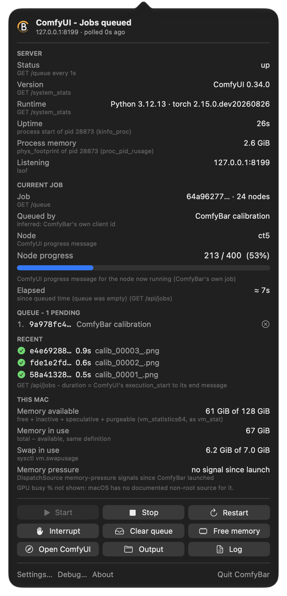

# ComfyBar

**See your local [ComfyUI](https://github.com/comfyanonymous/ComfyUI) from the macOS menu bar - and start, stop and interrupt it.**

A small native macOS app (Swift, no dependencies). Free and open source under the MIT licence.

<p align="center"></p>

## What it shows

The menu-bar mark - an open **C** with a **B** inside - tells you the state at a glance.
The C carries the colour; the B follows your light or dark menu bar.

| C colour | Meaning |
|---|---|
| grey | ComfyUI is not running |
| green | idle |
| blue, filling along the C | running a job (the fill is its progress) |
| orange | jobs are queued |
| red | error or unreachable |

Optionally show text beside it: progress %, queue length, memory in use, or elapsed time.

Click it for the panel:

- **Server** - up/down, version, uptime, the process's own memory footprint, listening address.
- **Current job** - who queued it (when that can be inferred), the running node, step x/y with a
  progress bar, elapsed time, and the sampler's own estimate for the current pass.
- **Queue** and **Recent** jobs, with durations.
- **This Mac** - memory available, memory in use, swap, memory-pressure signals.

Every figure names its source in small print underneath - nothing is shown that can't be verified
(so there is, for example, no GPU % - macOS has no documented non-root source for it).

## What it does

Start · Stop · Restart · Interrupt the running job · Cancel a queued job · Clear the queue ·
Free memory · Open ComfyUI in the browser · Open the output folder · Open the log.

Anything that would end work in progress asks first and names the job it would end.
Notifications (each switchable): job finished, job failed, server went down.

**Safety:** Start runs `<ComfyUI folder>/venv/bin/python main.py --port <port>` and **never binds
anything but 127.0.0.1**: `--listen` (and its abbreviations), `--tls*`, `--enable-cors*` and
non-loopback hosts are refused, and a server that nonetheless comes up on a non-loopback address
is stopped immediately. ComfyBar only ever reads a server it did not start until you press a
control, and it never impersonates another client's websocket connection.

## Install

Download the notarised `ComfyBar-vX.Y.Z.dmg` from
[Releases](../../releases), open it and drag ComfyBar to Applications. macOS 14 or later.

Then open **Settings…** in the panel: ComfyUI folder (default `~/ComfyUI`, with its `venv`), host
and port (default `127.0.0.1:8188`), poll interval, menu-bar text, notifications, launch at login.

## How progress is read (and why it's sometimes "not visible")

ComfyUI sends step-by-step progress over its websocket **only to the client that queued the
job**. ComfyBar deliberately does not join another client's connection - doing so disconnects
that client (for example, the ComfyUI web page) from its own updates. Instead it uses:

1. its own websocket: ComfyUI broadcasts progress to everyone for prompts queued without a
   `client_id`;
2. the sampler progress bar in ComfyUI's console buffer (`GET /internal/logs/raw`).

When neither is available, the panel says so rather than guessing. Details and file:line
references into ComfyUI are in [docs/GROUNDING.md](docs/GROUNDING.md).

## Build from source

```sh
brew install xcodegen
git clone https://github.com/AmritusG/comfybar.git && cd comfybar
./scripts/test.sh     # unit tests (they never contact a ComfyUI server)
./scripts/build.sh    # -> ./ComfyBar.app
open ComfyBar.app
```

Without the maintainer's Developer ID certificate, builds are ad-hoc signed automatically - they
run fine on your own Mac. Maintainers: `scripts/notarize.sh`, `scripts/make-dmg.sh`,
`scripts/check-release.sh` and `scripts/release.sh` produce and publish a notarised release.

## Licence

MIT - see [LICENSE](LICENSE). ComfyBar is not affiliated with ComfyUI or Comfy Org.
